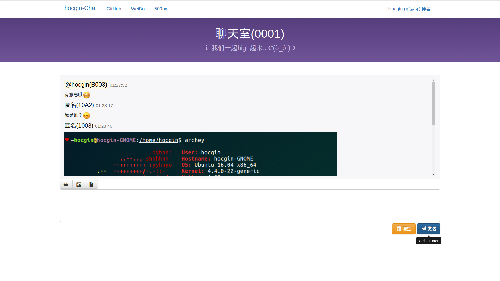
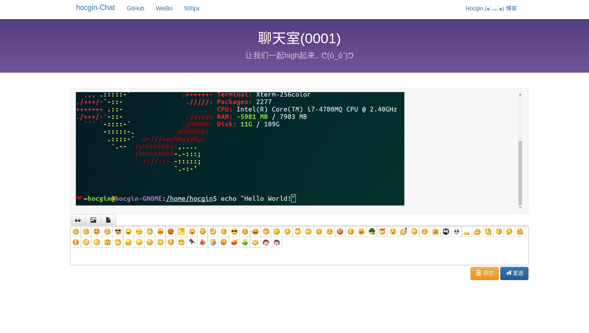
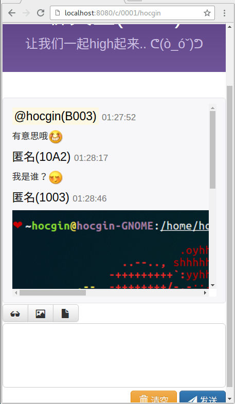

## Chat
> This is `Chat`.

## Update
> **1.0.1** 2016年08月17日01:11:17

- 响应式设计
- 支持表情发送
- 支持图片发送
- 支持文件发送
- 支持快捷键
- and so on

> **1.0.2** 2016年08月19日19:05:53

- Maven化
- 通用异常拦截器
- 常规跳转

-------------------------------------
## Structure [pom.xml](https://github.com/hocgin/ChatHTML/blob/master/pom.xml)
- Nutz-nutz-1.r.57.r3
- mysql-connector-java-5.1.37
- [JLog](https://github.com/hocgin/JLog)
- gson-2.7
- druid-1.0.16
- tomcat 8.0.36

## Usage
入口: http://localhost:8080/c/{room}/{name}

## Screenshot

